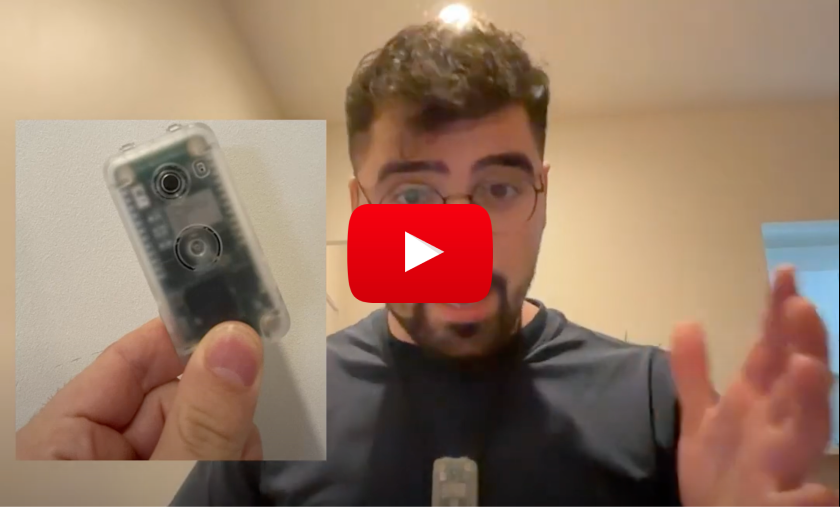

<div align="center">

# **Adeus**

Open-Source AI Wearable Device, the future depends on it!


<h3>

[Homepage](https://www.adeus.ai/) | [Documentation](https://docs.adeus.ai/) | [Discord](https://discord.gg/XEdusZqK)

</h3>

[](https://github.com/adamcohenhillel/ADeus)

In the upcoming world of AI devices like [Tab](https://mytab.ai/), [Pin](https://hu.ma.ne/aipin), [Rewind](https://www.rewind.ai/pendant), that are with us all the time, **literally** listening to everything we say, and know much about us as our closest friends - it is crucial to be able to own this setup, to own our data, to have this completely open source, managed by the user itself.

</div>

## Table of contents

- [Introduction](#introduction)
- [Setup](#setup)
  - [Supabase](#setup-supabase-↗)
  - [Web / Mobile App](#setup-app-↗)
  - [Hardware (Coral AI)](#setup-hardware-coral-ai-device-↗)
- [Areas to Contribute](#areas-to-contribute)
- [CTA for the Community](#cta-for-the-community)

## Introduction

Adeus consists of 3 parts:

1. **A mobile / web app:**
   an interface that lets the user to interact with their assistant and data via chat.

2. **Hardware device (Currently Coral AI, but soon a Rasberry-Pi Zero W worth $15):** this will be the wearable that will record everything, and send it to the backend to be processed
3. **Supabase :** Our backend, and datavase, where we will process and store data, and interact with LLMs.
   Supabase is an open source Firebase alternative, a "backend-as-a-service" - which allows you to setup a Postgres database, Authentication, Edge Functions, Vector embeddings, and more - for free (at first) and at extreme ease!
   - [!!] But more importantly - **it is open source, and you can choose to deploy and manage your own Supabase instance** - which us crucial for our mission: A truly open-source, personal AI.

This will look something like:


## Setup

A'ight, let's get this working for you!

1. Clone the repo:

```bash
git clone https://github.com/adamcohenhillel/ADeus
```

2. #### [Setup Supabase ↗](./docs/setup_supabase.md)

3. #### [Setup App ↗](./docs/setup_app.md)

4. #### [Setup Hardware (Coral AI device) ↗](./docs/setup_coralai.md)

## How to Contribute:

As people will soon notice, my C++ skills are limited, as well as my React and hardware skills :P - any help would be amazing! Contributions are more than welcomed. This should be maintained by us, for us.

Build it for yourself, and build it for others. This can become the Linux of the OS, the Android of the mobile. It is raw, but we need to start from somewhere!

- [ ] An easy setup script / deploy my own Ollama server to replace OpenAI [ticket #6](https://github.com/adamcohenhillel/AdDeus/issues/6)
- [ ] Add How-to for Ollama setup ([ticket #9](https://github.com/adamcohenhillel/AdDeus/issues/9))

## CTA for the Community:

A lot of companies and organizations are now after building the "Personal AI" - the one that will be a companion for individuals. This will be a paradigm shift of the way we all experince the digital (and physical) realms. Interacting with our AI that knows a lot about us, and help us navigate the world.

The problem with all these initiatives, is that they don't really provide you with your own personal AI. It’s not private, you don’t own it. As long as you don’t have a way to opt out, and take your so-called personal AI elsewhere, it’s not yours, you merely renting it from somewhere.

**Personal AI should be like a personal computer, connected to the internet.**

The pioneers of the personal computers, the internet, they all knew it - and that what made it great, a period of possibilities. But since, as we all know, things had drifted. You don’t own things, merely renting them. You can’t take it elsewhere - and therefore the free-market forces of capitalism can’t be easily integrated into the digital realm.

Check out the Intro video:

[](https://youtu.be/4CqEC2yLGQU)
