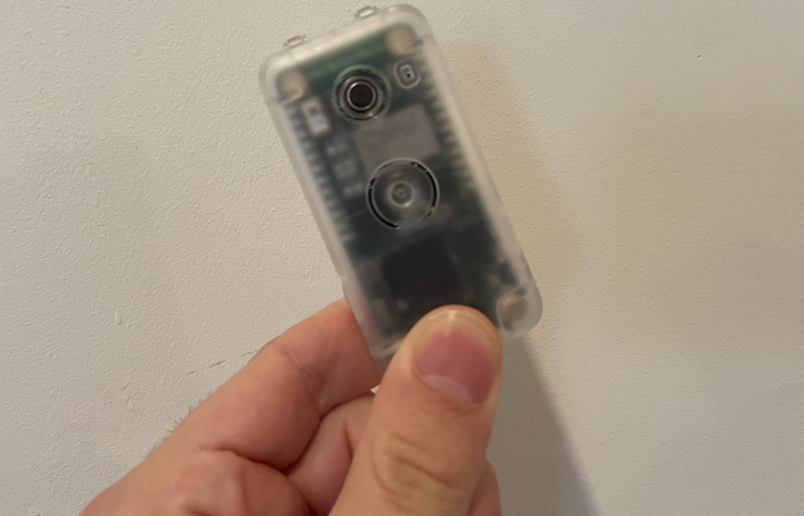
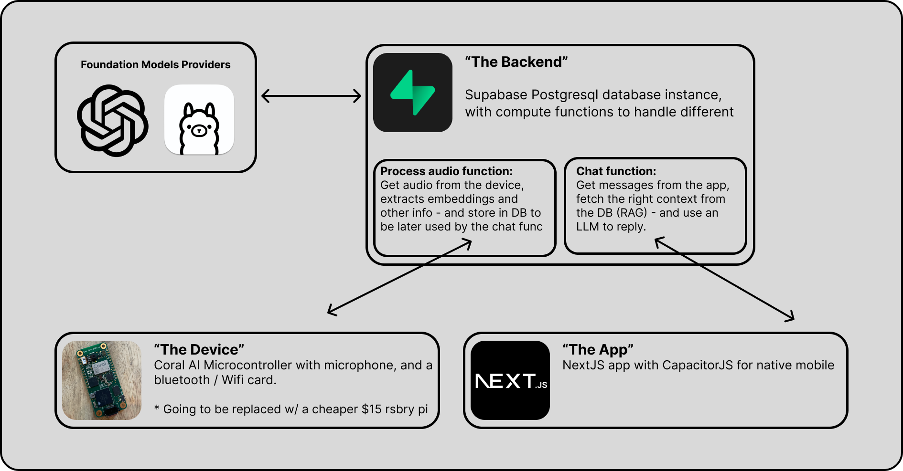

# ADeus: Open-Source AI Wearable Device

In the upcoming world of AI devices like [Tab](https://mytab.ai/), [Pin](https://hu.ma.ne/aipin), [Rewind](https://www.rewind.ai/pendant), that are with us all the time, **literally** listening to everything we say, and know much about us as our closest friends - it is crucial to be able to own this setup, to own our data, to have this completely open source, managed by the user itself.

**This is Adeus, the Open Source AI Wearble device -** and in this repo, you will be guided on how to set up your own! From buying the hardware (~$100, and will be cheaper once we finish the Raspberry PI Zero version) to setting up the backend, the software, and start using your wearable!

- [Introduction](#introduction)
- [Setup](#setup)
  - [Prerequisite](#prerequisite-110)
  - [Supabase](#supabase)
  - [Web / Mobile App](#app-web)
  - [Hardware (Coral AI)](#hardware---coral-ai-device)
  - [Hardware (Rasberry Pi Zero)](#supabase)
  - [Run with Ollama](#run-with-ollama)
- [Areas to Contribute](#areas-to-contribute)
- [CTA for the Community](#cta-for-the-community)



> p.s. any contribution would be amazing, whether you know how to code, and want to jump straight in to the codebase, a hardware person who can help out, or just looking to support this project financially (can literally be $10) - please reach out to me on X/Twitter [@adamcohenhillel](https://twitter.com/adamcohenhillel)

### Introduction:

Adeus consists of 3 parts:

1. **A mobile / web app:**
   an interface that lets the user to interact with their assistant and data via chat.

2. **Hardware device (Currently Coral AI, but soon a Rasberry-Pi Zero W worth $15):** this will be the wearable that will record everything, and send it to the backend to be processed
3. **Supabase :** Our backend, and datavase, where we will process and store data, and interact with LLMs.
   Supabase is an open source Firebase alternative, a "backend-as-a-service" - which allows you to setup a Postgres database, Authentication, Edge Functions, Vector embeddings, and more - for free (at first) and at extreme ease!
   - [!!] But more importantly - **it is open source, and you can choose to deploy and manage your own Supabase instance** - which us crucial for our mission: A truly open-source, personal AI.

This will look something like:


## Setup

> Note: I'm working on an easy setup.sh file that will do everything here more or less automatically, but it is still in the making

A'ight, let's get this working for you!

#### Prerequisite: ($110)

1. [Dev Board Micro](https://coral.ai/products/dev-board-micro/) ($80)
2. [Wireless/Bluetooth Add-on](https://coral.ai/products/wireless-add-on/) ($20)
3. [A case](https://coral.ai/products/dev-board-micro-case/) (Optional, 10$)
4. Either an OpenAI key, or a Ollama server running somewhere you can reach via internet

> Note: We are working on a version of this working with Raspberry PI Zero W, which will cost ~$20, stay tuned

First - cloning the repo:

```bash
git clone https://github.com/adamcohenhillel/AdDeus
```

### Supabase:

We will use Supabase as our database (with vector search, pgvector), authentication, and cloud functions for processing information.

1. Go to [supabase.co](https://supabase.co), create your account if you don't have one already
2. Click "New Project", give it a name, and make sure to note the database password you are given
3. Once the project is created, you should get the `anon public` API Key, and the `Project URL`, copy them both, as we will need them in a bit.
4. Go to your terminal, and cd to the supabase folder - `cd AdDeus/supabase`
5. Now, we need to install Supabase and set up the CLI, ideally, you should follow thier guide [here](https://supabase.com/docs/guides/cli/getting-started?platform=macos#installing-the-supabase-cli), but in short:
   - run `brew install supabase/tap/supabase` to install the CLI (or [check other options](https://supabase.com/docs/guides/cli/getting-started))
   - Install [Docker Desktop](https://www.docker.com/products/docker-desktop/) on your computer (we won't use it, we just need docker dameon to run in the background for deploying supabase functions)
6. Now we need to login to Supabase CLI by running `supabase login` - this should pop up a browser window, which should prompt you through the auth
7. And link our Supabase CLI to a specific project, our newly created one, by running `supabase link --project-ref <your-project-id>` (you can check what the project id is from the Supabase web UI, or by running `supabase projects list`)
8. We can now deploy our functions! ([see guide for more details](https://supabase.com/docs/guides/functions/deploy)) `supabase functions deploy --no-verify-jwt`
9. Lasly - if you're planning to first use OpenAI as your Foundation model provider, then you'd need to also run the following command, to make sure the functions have everything they need to run properly: `supabase secrets set OPENAI_API_KEY=<your-openai-api-key>`

If everything worked, we should now be able to

### App (Web):

Now that you have a Supabase instance that is up and running, you can technically start chatting with your assistant, it just won't have any personal data it.

To try it out, you can either use the deployed version of the web app here: [adeusai.com](https://adeusai.com) - which will ask you to connect to your own Supabase instance (it is only a frontend client).

Or you can deploy the app yourself somewhere - the easiest is Vercel, or locally:

```
cd app
npm i
npm run dev
```

Once you have an app instance up and running, head to its address `your-app-address.com/`, and you should see the screen:


Enter the four required details, which you should've obtained in the Supabase setup: Supabase URL, Supabase Anon API Key, email and password.

And that is it - you should be able to start chatting!

Lastly, we need to set up our hardware device, so we could start provide crucial context to our personal AI.

### Hardware - Coral AI device

To set up

```
brew install gcc
brew install ngrok/ngrok/ngrok
```

In the root folder of this repository, run the following commands, which will download the Coral AI Micro Dev repository dependencies to your computer (it might take a while)

```bash
git submodule add  https://github.com/google-coral/coralmicro devices/coralai/coralmicro
```

```bash
git submodule update --init --recursive
```

Now that it finished, CD to the folder:

```bash
cd devices/coralai
```

And run the setup script:

```bash
bash coralmicro/setup.sh
```

> Note that if you're using Apple Silicon Mac, you might need to change the `coralmicro/scripts/requirements.txt` file, making the version of the package `hidapi==0.14.0` (see [issue](https://github.com/google-coral/coralmicro/pull/98))

Once that it finished setting up, make sure to connect your Mic

```bash
cmake -B out -S .
```

```bash
make -C out -j4
```

```bash
python3 coralmicro/scripts/flashtool.py --build_dir out --elf_path out/coralmicro-app --wifi_ssid "<WIFI_NAME>" --wifi_psk "<WIFI_PASSWORD>"
```

It should be something like:


### Hardware - Rasberry Pi Zero W

SOON! (cost $15, but need to solder a microphone)

### Run with Ollama

How-to will be written here soon, but it should be fairly simple with Ollama serve and `ngrok http 11434`

## Areas to Contribute:

Contributions are more than welcomed. This should be maintained by us, for us.
As people will soon notice, by C++ skills are limited, as well as my React and hardware skills - esssicntialy the entire pipeline of this project :P - any help would be amazing.

Build it for yourself, and build it for others. This can become the Linux of the OS, the Android of the mobile. It is raw, but we need to start from somewhere.

### Known Bugs:

- [ ] Whisper tends to generate YouTube-like text when the audio is unclear, so you can get noise data in the database like "Thank you for watching", and "See you in the next video" - evem though it has nothing to do with the audio

- [ ] Currently it is using Wi-Fi, which makes it not-so mobile. An alternative approach would either be:
  - [ ] Bluetooth, pairing with the mobile device
  - [ ] Sdd a 4G card that will allow it to be completly independent

#### Backend:

- [ ] The RAG (Retrieval-Augmented Generation) can be extremely improved:
  - [ ] Need to process the audio not only into "embeddings" but also run an LLM on it to generate some context
  - [ ] Need to query the RAG more effiecntly, maybe with timestamp as well, etc. - not only embeddings (relates to the processing part)
- [ ] Improve security - currently I didn't spent too much time making the Supabase RLS really work (for writing data)

#### Hardware / On-device:

- [ ] Run on a Rasberry Pi Pico / Zero, as it is much much cheaper, and should do the work too
- [ ] Currently the setup is without battery, need to find the easiest way to add this as part of the setup

#### Mobile:

1. Improve user setup?

#### UX and Onboarding

1. An easy setup script / deploy my own Ollama server to replace OpenAI

## CTA for the Community:

A lot of companies and organizations are now after building the "Personal AI" - the one that will be a companion for individuals. This will be a paradigm shift of the way we all experince the digital (and physical) realms. Interacting with our agents that knows a lot about us, and help us navigate the world.

The problem with all these initiatives, is that they don't really provide you with your own personal AI. It’s not private, you don’t own it. As long as you don’t have a way to opt out, and take your so-called personal AI elsewhere, it’s not yours, you merely renting it from somewhere.

**Personal AI should be like a personal computer, connected to the internet.**

The pioneers of the personal computers, the internet, they all knew it - and that what made it great, a period of possibilities. But since, as we all know, things had drifted. You don’t own things, merely renting them. You can’t take it elsewhere - and therefore the free-market forces of capitalism can’t be easily integrated into the digital realm.
