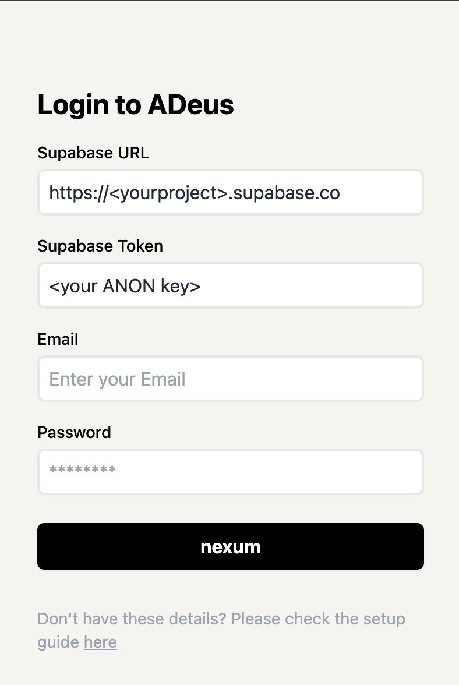

# Getting Started (Setup)
{: .no_toc }

## Table of contents
{: .no_toc .text-delta }

1. TOC
{:toc}

---

A'ight, let's get this working for you!

1. Clone the repo:

```bash
git clone https://github.com/adamcohenhillel/ADeus
```

## Backend (Supabase)

Supabase is an open source Firebase alternative, a "backend-as-a-service" - which allows you to setup a Postgres database, Authentication, Edge Functions, Vector embeddings, and more - for free (at first) and at extreme ease!

But more importantly - **it is open source, and you can choose to deploy and manage your own Supabase instance** - which is crucial for our mission: A truly open-source, personal AI.

We will use Supabase as our database (with vector search, pgvector), authentication, and cloud functions for processing information.

1. Go to [supabase.co](https://supabase.co), create your account if you don't have one already
2. Click "New Project", give it a name, and make sure to note the database password you are given

   

3. Once the project is created, you should get the `anon public` API Key, and the `Project URL`, copy them both, as we will need them in a bit.

   

4. Now, go to the authentication tab on the right navbar (), note that it can take a few moments for Supabase to finish setup the project

5. There, you will see the "user management" UI. Click "Add User" -> "Add new user", fill an email and password, and make sure to check the "auto-confirm" option.

   

6. By now, you should have 4 things: `email` & `password` for your supabase user, and the `Supabase URL` and `API Anon Key`.

7. If so, go to your terminal, and cd to the supabase folder: `cd ./supabase`

8. Install Supabase and set up the CLI. You should follow thier [guide here](https://supabase.com/docs/guides/cli/getting-started?platform=macos#installing-the-supabase-cli), but in short:
   - run `brew install supabase/tap/supabase` to install the CLI (or [check other options](https://supabase.com/docs/guides/cli/getting-started))
   - Install [Docker Desktop](https://www.docker.com/products/docker-desktop/) on your computer (we won't use it, we just need docker daemon to run in the background for deploying supabase functions)
9. Now when we have the CLI, we need to login with our Supabase account, running `supabase login` - this should pop up a browser window, which should prompt you through the auth
10. And link our Supabase CLI to a specific project, our newly created one, by running `supabase link --project-ref <your-project-id>` (you can check what the project id is from the Supabase web UI, or by running `supabase projects list`, and it will be under "reference id") - you can skip (enter) the database password, it's not needed.
11. Now we need to apply the Adeus DB schema on our newly created, and empty database. We can do this by simply run: `supabase db push`. We can verify it worked by going to the Supabase project -> Tables -> and see that new tables were created.
12. Now let's deploy our functions! ([see guide for more details](https://supabase.com/docs/guides/functions/deploy)) `supabase functions deploy --no-verify-jwt` (see [issue re:security](https://github.com/adamcohenhillel/AdDeus/issues/3))
13. If you're planning to first use OpenAI as your Foundation model provider, then you'd need to also run the following command, to make sure the functions have everything they need to run properly: `supabase secrets set OPENAI_API_KEY=<your-openai-api-key>` (Ollama setup guide is coming out soon)
14. If you want access to tons of AI Models, both Open & Closed Source, set up your OpenRouter API Key. Go to [OpenRouter](https://openrouter.ai/) to get your API Key, then run `supabase secrets set OPENROUTER_API_KEY=<your-openrouter-api-key>`.

If everything worked, we should now be able to start chatting with our personal AI via the app - so let's set that up!


**Setup: Run with Ollama**

Check under [How to guides](https://docs.adeus.ai/guides/guides.html)

---

## Web & Mobile App

Now that you have a Supabase instance that is up and running, you can technically start chatting with your assistant, it just won't have any personal data it.

To try it out, you can either use the deployed version of the web app here: [adeusai.com](https://adeusai.com) - which will ask you to connect to your own Supabase instance (it is only a frontend client).

Or you can deploy the app yourself somewhere - the easiest is Vercel, or locally:

from the root folder:

```bash
cd ./app
```

npm install and run:

```bash
npm i
npm run dev
```

Once you have an app instance up and running, head to its address `your-app-address.com/`, and you should see the screen:



Enter the four required details, which you should've obtained in the Supabase setup: `Supabase URL`, `Supabase Anon API Key`, `email` and `password`.

And you should be able to start chatting!

Now - let's configure our hardware device, so we could start provide crucial context to our personal AI!

---

## Hardware

- [CoralAI device](https://docs.adeus.ai/archive/setup_coralai.html)
- [Raspberry Pi Zero 2W](https://docs.adeus.ai/guides/setup_raspberry_pi_zero.html)
- ESP32 soon
