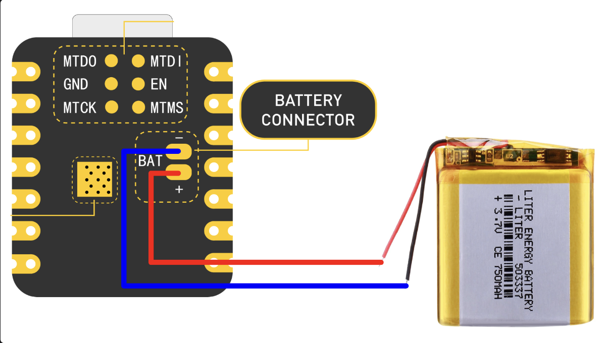
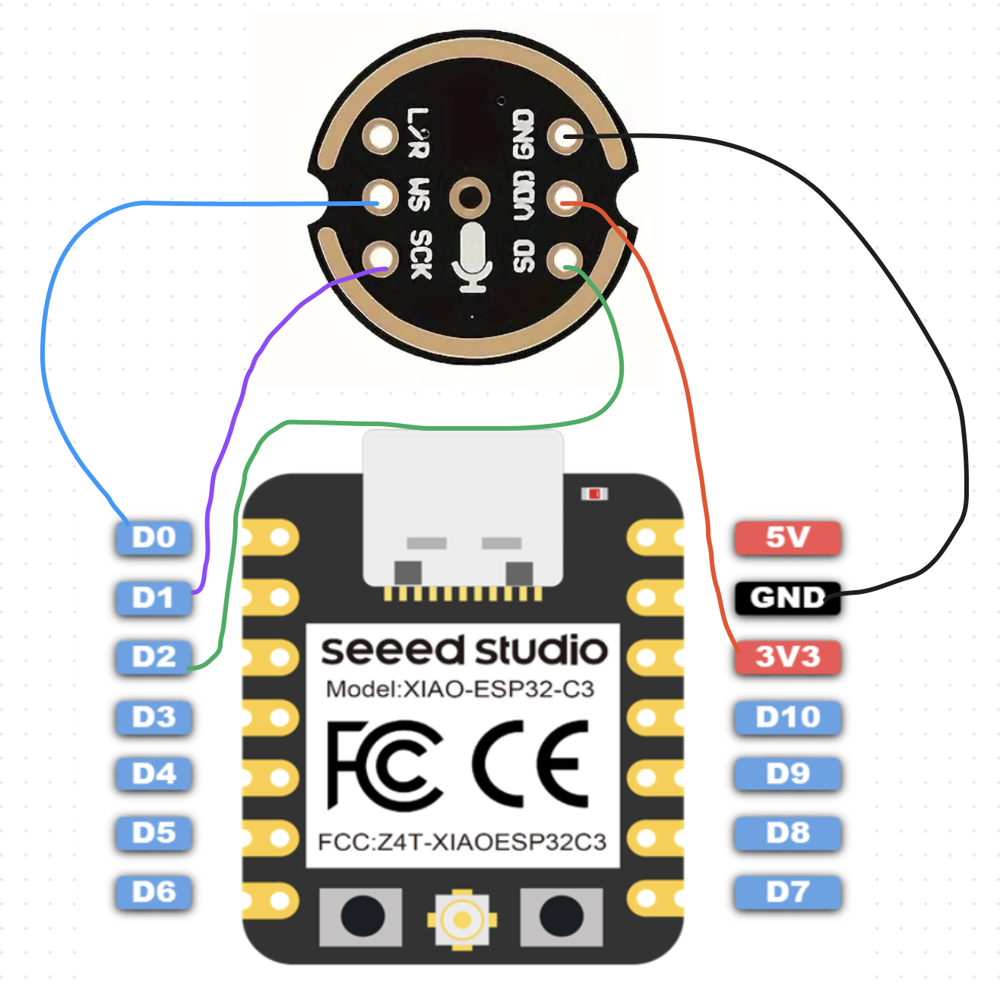

# ESP32-C3 Setup Guide
{: .no_toc }

## Table of contents
{: .no_toc .text-delta }

1. TOC
{:toc}

---
This guide provides step-by-step instructions for setting up a ESP32-C3 with the necessary software and configurations for development purposes.

## Prerequisites

- [ESP32-C3](https://www.seeedstudio.com/Seeed-XIAO-ESP32C3-p-5431.html)
- [INMP441 I2S mic module](https://www.amazon.com/AITRIPAITRIP-AITRIP-Omnidirectional-Microphone-Interface/dp/B0972XP1YS?crid=NBMF8X1BHW65&dib=eyJ2IjoiMSJ9.2dMpPpY1QmJE7SgIFHE9li1pbo7HG2E_Iv_iCSA8EWrrF0Zx_OgFFHhaCFIWYweJGzZ0s-4fEa1o0hUUTRmtALEw3wlOPzRLymsQgY7RC42_Z4QnSTNomi5qu28ePQvpulr0iU9B1da-RYYU4fy_Sr0Gc0o_c2m4fCVQQV3egOAdWRw0CBJCbu-EOjzShp_cZEaEY8nOmYKVpQoQx5ml7j4fmG68lyS6M46U5cG3W514j9eZqLW8yAat97fxRMmV-F7l9yfVdfZFtYEgjq9uXdsQhGaeFf-HKmeje2ybgtI.E8HfHZ4zHW-vyigcGMpJpSz6Kk34D8P6yRoG-vpNgUY&dib_tag=se&keywords=inmp441&qid=1709594739&sprefix=inmp441,aps,149&sr=8-5)
- USB-C cable
- Access to a computer with an SD card reader
- Clone https://github.com/adamcohenhillel/ADeus
> **_NOTE:_**  You can buy ESP32-C3 on [Amazon](https://www.amazon.com/Seeed-Studio-XIAO-ESP32C3-Microcontroller/dp/B0B94JZ2YF?crid=3FZFGDPS5BTIQ&dib=eyJ2IjoiMSJ9.dMro3Q-laiyKo0RDNW_XioOuBBUCjnQSK2wgSczwXKPEWZzKJRtiVBm2VNmKnBDJyV6LYv-XVSPDrcH0djS7Alp6H2eOwkJLIZxhvmXwMWyW2raj-rzkljoigeptk9VbM-qB4cdbegpW2OT3Fk22_-7MehAHADpbihIiXnDcSZCgTfSy1Q_YFJ3fb1uRYo9-hbnJIxV4Ul8dHuzinezujbnZdgcb3D-iXJRUb5vcDz4.KnRxEjTB-gXToZR6XM74B9n_9FwQRLw2s7gHk5hRRLs&dib_tag=se&keywords=seeed+studio+xiao+esp32c3&qid=1709594670&sprefix=seeed+studi,aps,157&sr=8-1-spons&sp_csd=d2lkZ2V0TmFtZT1zcF9hdGY) for faster delivery, but twice the price.

> **_WARNING:_**  Don't use [Adafruit I2S MEMS Microphone](https://www.adafruit.com/product/3421), it has some weird clock incompatability with esp32


## Hardware Setup
We recommend soldering a battery first.

1. Solder a 3.7 lithium battery as the power supply.



> **_CAUTION:_**  Please be careful not to touch the positive and negative wires when soldering.

> **_NOTE:_**  When operating with battery, your `ESP32C3` won't have an LED on.

2. Solder a Microphone to the board




## Installation Instructions

### 1. Install ESP-IDF
[Manual Installation](https://docs.espressif.com/projects/esp-idf/en/v5.2/esp32c3/get-started/linux-macos-setup.html#for-macos-users) or [VS Code](https://github.com/espressif/vscode-esp-idf-extension/blob/master/docs/tutorial/install.md)

> **_WARNING:_**  Currently, this project can be used with ESP-IDF versions between 5.1.0 and 5.1.99, it won't work with a newer version.

### 2. Install Arduino dependencies
```
cd devices/esp32-c3
cd components && \
git clone https://github.com/espressif/arduino-esp32.git arduino && \
cd arduino && \
git submodule update --init --recursive && \
cd ../.. && \
idf.py menuconfig
```

### 3. Flash the device
```
cd devices/esp32-c3
idf.py flash
```

## Testing
Bluetooth only works on iOS and Android. 

1. Run the app
```
npm run ios # iOS
# or 
npm run android # Android
```
2. Click on the device named ESP32.


3. Check supabase for new transcriptions


Congratulations! You have an ESP32C3 setup correctly.
