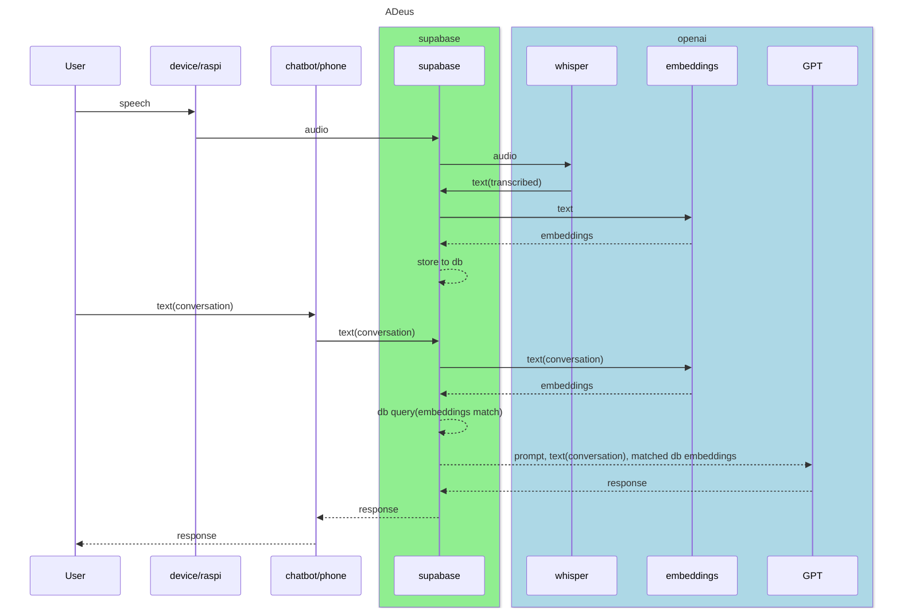

# Adeus Sequence

```mermaid
sequenceDiagram
    participant user as User
    participant device as device/raspi
    participant chatbot as chatbot/phone
box lightGreen supabase
    participant supabase as supabase
end
box lightBlue openai
    participant whisper as whisper
    participant embeddings as embeddings
    participant GPT as GPT
end

    title ADeus

    user ->> device: speech
    device ->> supabase: audio
    supabase ->> whisper: audio
    whisper ->> supabase: text(transcribed)
    supabase ->> embeddings: text
    embeddings -->> supabase: embeddings
    supabase -->> supabase: store to db

    user ->> chatbot: text(conversation)
    chatbot ->> supabase: text(conversation)
    supabase ->> embeddings: text(conversation)
    embeddings -->> supabase: embeddings
    supabase -->> supabase: db query(embeddings match)
    supabase -->> GPT: prompt, text(conversation), matched db embeddings
    GPT -->> supabase: response
    supabase -->> chatbot: response
    chatbot -->> user: response
```
