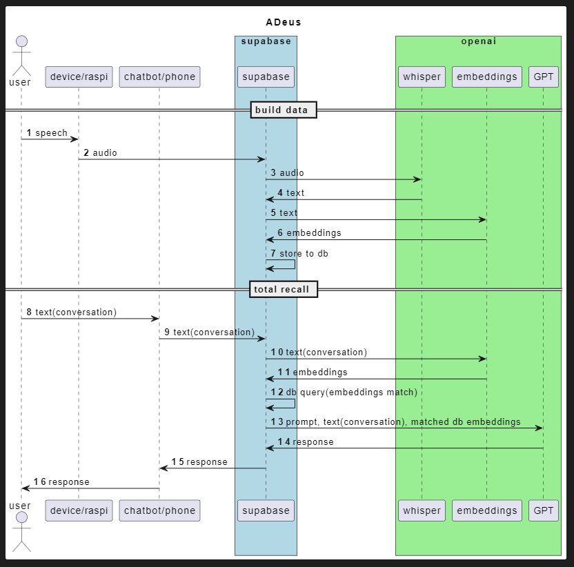

# Adeus Documentation
{: .no_toc }

## Table of contents
{: .no_toc .text-delta }

1. TOC
{:toc}

## Introduction

Welcome dear contributer,

Open-source contributors, like yourself, are the unsung heroes of technology, the backbone of our modern, OPEN, world.

So, thank you for being here, and now, **let's get started!**

---

## Why Adeus?

In the upcoming world, Personal AI will become an integrated part of our daily lives, they will be with us all the time, and will know much about us as our closest friends - and therefore, with Adeus, we are making sure it is completely open-source, and that you can **own** you own data.

--- 

## How Adeus is Built

Adeus consists of 3 parts:

1. **A mobile / web app:**
   an interface that lets the user to interact with their assistant and data via chat.

2. **Hardware device (Currently Coral AI, but soon a Rasberry-Pi Zero W worth $15):** this will be the wearable that will record everything, and send it to the backend to be processed
3. **Supabase :** Our backend, and datavase, where we will process and store data, and interact with LLMs.
   Supabase is an open source Firebase alternative, a "backend-as-a-service" - which allows you to setup a Postgres database, Authentication, Edge Functions, Vector embeddings, and more - for free (at first) and at extreme ease!
   - [!!] But more importantly - **it is open source, and you can choose to deploy and manage your own Supabase instance** - which us crucial for our mission: A truly open-source, personal AI.

**Sequence:**

---

## Where to go Next

-> [Getting Started](https://docs.adeus.ai/getting_started.html)

---

## How to Contribute

Adeus is open-source and we welcome contributions. If you're looking to contribute, please:

- Fork the repository.
- Create a new branch for your feature.
- Add your feature or improvement.
- Send a pull request.

We appreciate your input!

You can also check the [TODOs](https://github.com/adamcohenhillel/ADeus/blob/main/TODO.md) if you're looking for things you can do

---

## Extra Resources:

- [Adam going over the entire codebase on livestream](https://www.youtube.com/watch?v=NoKahoN7nYE)
- [Adeus launch original Readme file](https://docs.adeus.ai/archive/launch_readme.html)

---

#### Made by the Community, with -❤️-:

