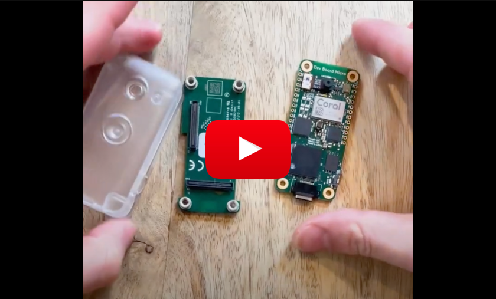

Setting up hardware

#### Prerequisite: ($110)

1. [Dev Board Micro](https://coral.ai/products/dev-board-micro/) ($80)
2. [Wireless/Bluetooth Add-on](https://coral.ai/products/wireless-add-on/) ($20)
3. [A case](https://coral.ai/products/dev-board-micro-case/) (Optional, 10$)
4. Either an OpenAI key, or a Ollama server running somewhere you can reach via internet

> Note: We are working on a version of this working with Raspberry PI Zero W, which will cost ~$20, stay tuned

### Setup: Hardware - Coral AI device

First, to learn more about the device, it is good to check out the [official docs](https://coral.ai/docs/dev-board-micro/get-started/). Our project is using [out-of-tree setup](official) with a [Wireless Add-on](https://coral.ai/docs/dev-board-micro/wireless-addon/).

Here is quick video showing how to "connect" the hardware pieces together, and install the software:

[](https://youtu.be/_2KRSlpnXrA)

In the root folder of this repository, run the following commands, (which will download the Coral AI Micro Dev dependencies to your computer - note that it might take a few minutes):

```bash
git submodule add  https://github.com/google-coral/coralmicro devices/coralai/coralmicro
```

```bash
git submodule update --init --recursive
```

Then, when it is finished, CD to the `devices/coralai` folder:

```bash
cd devices/coralai
```

And run the setup script, which will make sure your computer can compile the code and pass it on to the device:

> Note that if you're using Apple Silicon Mac, you might need to change the `coralmicro/scripts/requirements.txt` file, making the version of the package `hidapi==0.14.0` (see [issue](https://github.com/google-coral/coralmicro/pull/98))

```bash
bash coralmicro/setup.sh
```

```bash
export SUPABASE_URL"<YOUR_SUPABASE_URL"
```

> Note: Security RLS best practices is still WOP! (see [ticket #3](https://github.com/adamcohenhillel/AdDeus/issues/3))

Once the setup has finished running, you can connect your device via a USB-C, and run the following to create a build:

```bash
cmake -B out -S .
```

```bash
make -C out -j4
```

And then, flash it to your device with WIFI_NAME and WIFI_PASSWORD: (Bluetooth pairing is coming soon, see [ticket][https://github.com/adamcohenhillel/AdDeus/issues/8])

```bash
python3 coralmicro/scripts/flashtool.py --build_dir out --elf_path out/coralmicro-app --wifi_ssid "<WIFI_NAME>" --wifi_psk "<WIFI_PASSWORD>"
```

To debug the device, you can connect to it serial-y via the USB-C.

First, find the serial id
On Linux:

```bash
ls /dev/ttyACM*
```

On Mac:

```bash
ls /dev/cu.usbmodem*
```

Then run the [checkOutput.py](/devices/coralai/checkOutput.py) script:

```python
python3 checkOutput.py --device "/dev/cu.usbmodem101"
```

(replace the `/dev/cu.usbmodem*` with whatever you got in the `ls` command)

> Note: It might fail for the first few CURL requests, until it resolves the DNS
