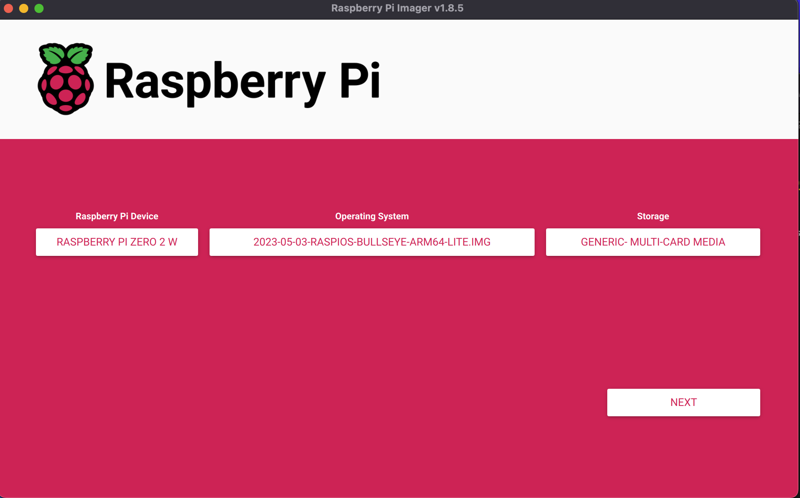
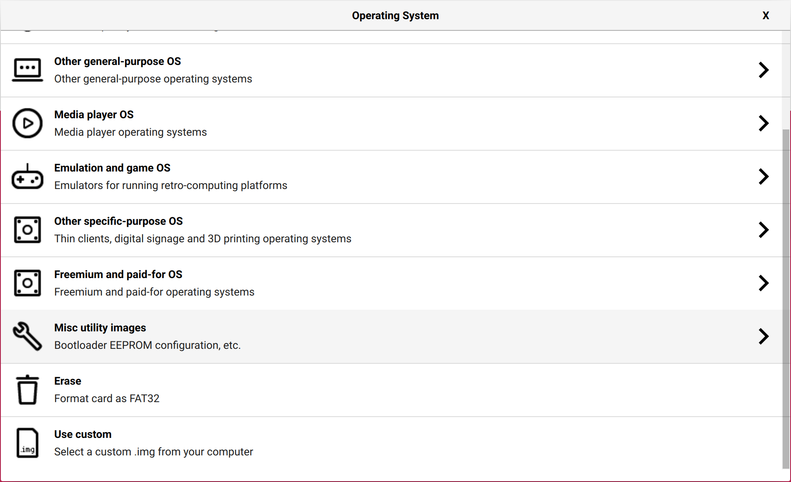
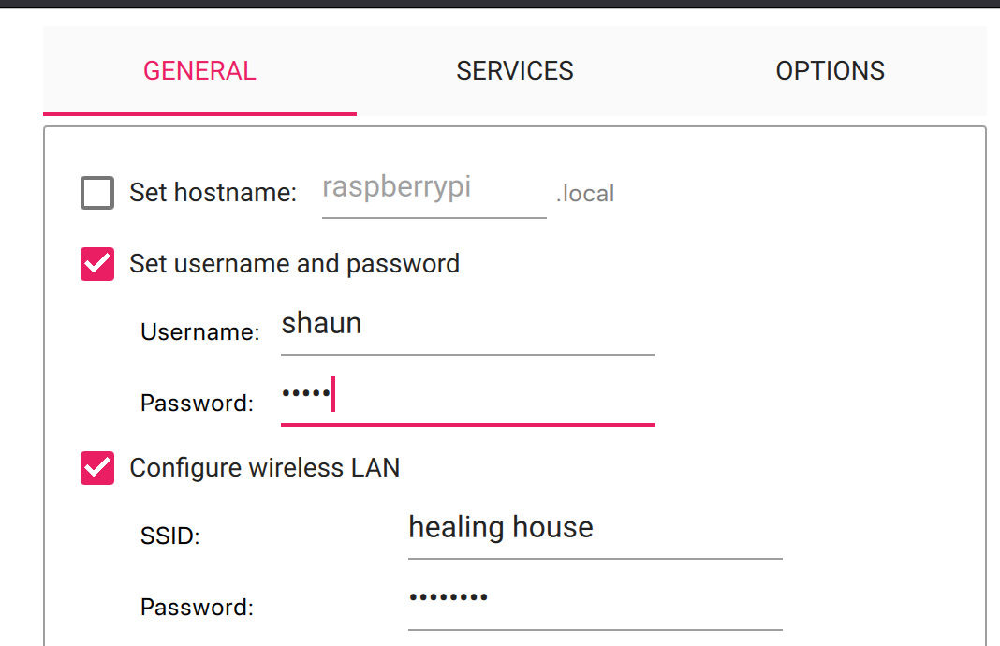
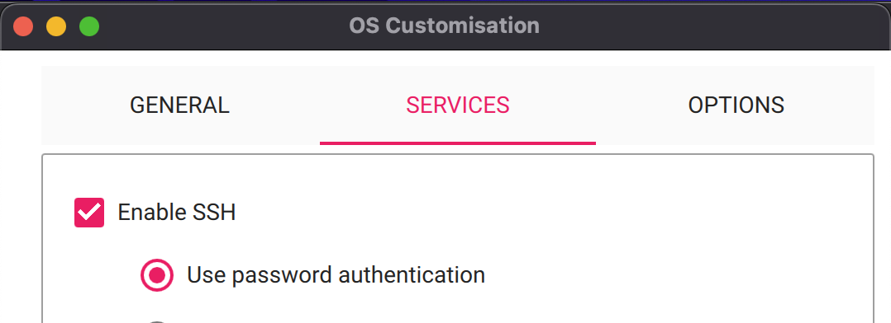

# Raspberry Pi Zero W Setup Guide

This guide provides step-by-step instructions for setting up a Raspberry Pi Zero W with the necessary software and configurations for development purposes.

## Prerequisites

- Raspberry Pi Zero W
- MicroSD card (8GB or larger recommended)
- Internet connection
- Access to a computer with an SD card reader
- Clone https://github.com/adamcohenhillel/ADeus

## Installation Instructions

### 1. Download Raspberry Pi Imager

Download the Raspberry Pi Imager from the official Raspberry Pi website:

[https://www.raspberrypi.com/software/](https://www.raspberrypi.com/software/)

### 2. Download OS Image

Download the Raspberry Pi OS Lite (64-bit) image from the following link:

[https://downloads.raspberrypi.com/raspios_lite_arm64/images/raspios_lite_arm64-2023-05-03/2023-05-03-raspios-bullseye-arm64-lite.img.xz](https://downloads.raspberrypi.com/raspios_lite_arm64/images/raspios_lite_arm64-2023-05-03/2023-05-03-raspios-bullseye-arm64-lite.img.xz)

### 3. Prepare SD Card

- Unzip the downloaded OS image.
- Insert your SD card into the computer.
- Run the Raspberry Pi Imager and select the unzipped OS image by clicking "Operating System > Use custom".
- Make the device selection as prompted.
- Edit settings to:
  - Enable SSH(under Services).
  - Add a username and password.
  - Add WiFi settings.
- Write the image to the SD card.







### 4. Boot Raspberry Pi

- Insert the SD card into your Raspberry Pi Zero W.
- Power on the device.
- Wait for the device to boot up (the light will stop blinking).

### 5. Connect via SSH

Open a terminal on your computer and connect to your Raspberry Pi using SSH:

```
ssh username@raspberrypi.local
```

Replace `username` with the username you set up earlier. Accept the prompt and enter your password when asked.

### 6. Transfer Project Files

From a terminal on your computer (not connected to your
Raspberry Pi), transfer the project folder to your Raspberry Pi:

```
scp -r /path/to/your/project/raspizerow username@raspberrypi:~/
```

### 7. Install Dependencies

Navigate to the project directory and run the installation script:

```
cd raspizerow
```

```
chmod +x install.sh
```

```
./install.sh
```

- Answer `yes` to "Auto load module at boot?"
- Answer `no` to "REBOOT NOW?"

Enter the `SUPABASE_URL` and `AUTH_TOKEN` when prompted.

### 8. Reboot

Reboot your Raspberry Pi:

```
sudo reboot
```

### 9. Run the Application

After the reboot, navigate back to the project directory, make the run script executable, and start the application:

```
cd raspizerow
```

```
chmod +x compile.sh
```

```
./compile.sh
```

```
gdb ./main
```

Optional: Start the application with GDB for debugging

Use `run` within gdb to start the application in debug mode.

Congratulations! You have successfully set up your Raspberry Pi Zero W for development with your project.
