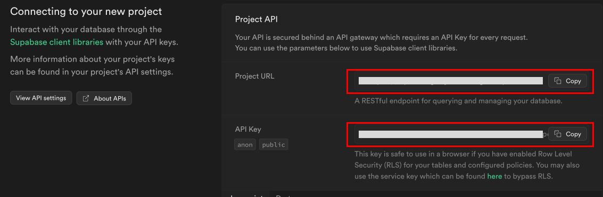
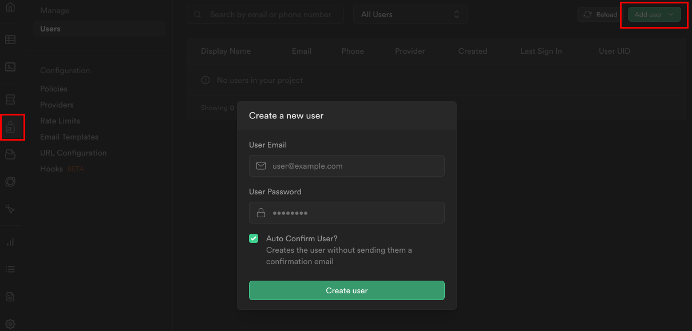
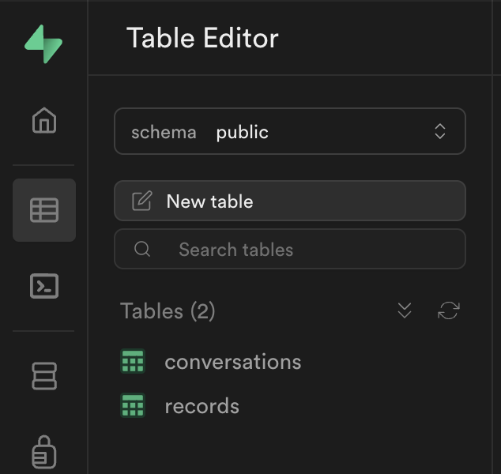

Supabase is an open source Firebase alternative, a "backend-as-a-service" - which allows you to setup a Postgres database, Authentication, Edge Functions, Vector embeddings, and more - for free (at first) and at extreme ease!

But more importantly - **it is open source, and you can choose to deploy and manage your own Supabase instance** - which is crucial for our mission: A truly open-source, personal AI.

We will use Supabase as our database (with vector search, pgvector), authentication, and cloud functions for processing information.

1. Go to [supabase.co](https://supabase.co), create your account if you don't have one already
2. Click "New Project", give it a name, and make sure to note the database password you are given

   

3. Once the project is created, you should get the `anon public` API Key, and the `Project URL`, copy them both, as we will need them in a bit.

   

4. Now, go to the authentication tab on the right navbar (), note that it can take a few moments for Supabase to finish setup the project

5. There, you will see the "user management" UI. Click "Add User" -> "Add new user", fill an email and password, and make sure to check the "auto-confirm" option.

   

6. From there, go to the SQL Editor tab () and paste the [schema.sql](/supabase/schema.sql) from this repo, and execute. This will enable all the relevant extensions (pgvector) and create the two tables:

   

7. By now, you should have 4 things: `email` & `password` for your supabase user, and the `Supabase URL` and `API Anon Key`.

8. If so, go to your terminal, and cd to the supabase folder: `cd ./supabase`

9. Install Supabase and set up the CLI. You should follow thier [guide here](https://supabase.com/../guides/cli/getting-started?platform=macos#installing-the-supabase-cli), but in short:
   - run `brew install supabase/tap/supabase` to install the CLI (or [check other options](https://supabase.com/../guides/cli/getting-started))
   - Install [Docker Desktop](https://www.docker.com/products/docker-desktop/) on your computer (we won't use it, we just need docker dameon to run in the background for deploying supabase functions)
10. Now when we have the CLI, we need to login with oour Supabase account, running `supabase login` - this should pop up a browser window, which should prompt you through the auth
11. And link our Supabase CLI to a specific project, our newly created one, by running `supabase link --project-ref <your-project-id>` (you can check what the project id is from the Supabase web UI, or by running `supabase projects list`, and it will be under "reference id") - you can skip (enter) the database password, it's not needed.
12. Now let's deploy our functions! ([see guide for more details](https://supabase.com/../guides/functions/deploy)) `supabase functions deploy --no-verify-jwt` (see [issue re:security](https://github.com/adamcohenhillel/AdDeus/issues/3))
13. Lasly - if you're planning to first use OpenAI as your Foundation model provider, then you'd need to also run the following command, to make sure the functions have everything they need to run properly: `supabase secrets set OPENAI_API_KEY=<your-openai-api-key>` (Ollama setup guide is coming out soon)

If everything worked, we should now be able to start chatting with our personal AI via the app - so let's set that up!

### Setup: Run with Ollama

How-to-Guide will be written here soon, but it should be fairly simple with [Ollama](https://ollama.ai/) serve and `ngrok http 11434`

```
brew install ngrok/ngrok/ngrok
```
